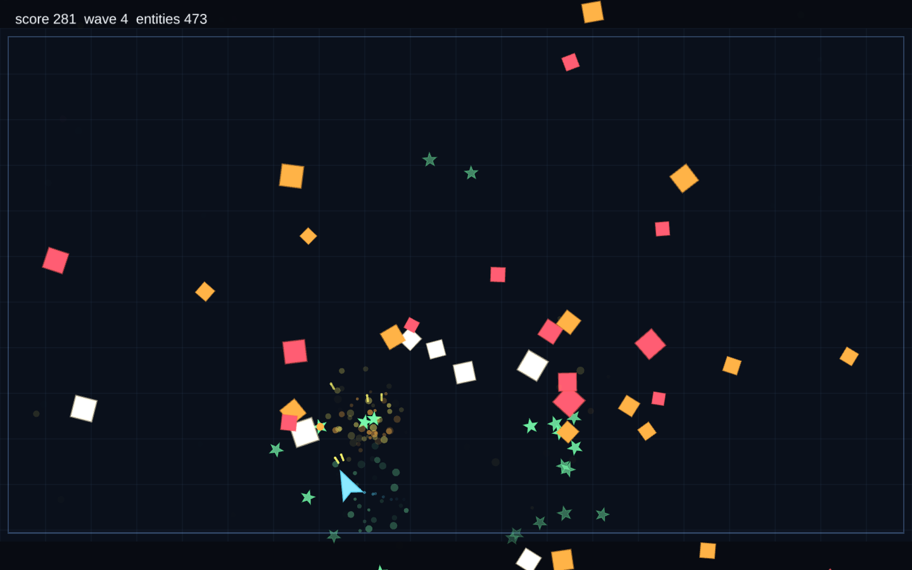

# anotherecs

A small, deterministic, dependency-free Entity Component System for TypeScript.

`anotherecs` is built for simulation and game code where entity iteration,
structural changes, and allocations need to be predictable. The core is compact:
integer entities, typed component definitions, sparse-set stores, cached
queries, and explicit flush points. Higher-level pieces such as schedules,
events, command buffers, change tracking, pooling, serialization, entity refs,
and spatial queries are opt-in.



## What You Get

- **Sparse-set component storage.** Components live in dense arrays for fast
  iteration, while entity ids remain stable until they are despawned and
  flushed.
- **Typed component definitions.** Components, tags, resources, events, and
  locals are defined once and then passed around as type-safe tokens.
- **Cached queries.** Use `query` for simple tuple results, `each` for hot
  callback loops, `compileQuery` for reusable handles, and `select` for
  `without`, `maybe`, and `any` filters.
- **Explicit structural boundaries.** `spawn` is immediate. `despawn` is
  deferred until `flush`, so system groups can run against a stable world view.
- **Opt-in systems work.** Add schedules, command buffers, frame events, change
  tracking, component pooling, bitmask acceleration, incremental queries,
  serializer codecs, migrations, entity handles/refs, and a spatial hash only
  when your project needs them.
- **No runtime dependencies.** The package ships compiled ESM and TypeScript
  declarations from `dist/`.

## Install

```bash
pnpm add @idleflowgames/anotherecs
```

## Basic Usage

Define component types once, create a world, add components to entities, then
iterate matching entities:

```ts
import { defineComponent, World } from "@idleflowgames/anotherecs";

const Position = defineComponent(
  "Position",
  () => ({ x: 0, y: 0 }),
  (c) => {
    c.x = 0;
    c.y = 0;
  },
);
const Velocity = defineComponent(
  "Velocity",
  () => ({ vx: 0, vy: 0 }),
  (c) => {
    c.vx = 0;
    c.vy = 0;
  },
);

const world = new World();
const e = world.spawn();

world.addComponent(e, Position);
world.addComponent(e, Velocity, { vx: 5 });

function move(world: World, dt: number): void {
  for (const [, pos, vel] of world.query(Position, Velocity)) {
    pos.x += vel.vx * dt;
    pos.y += vel.vy * dt;
  }
}

move(world, 1 / 60);
```

`defineComponent(name, create, reset)` creates a factory-backed component. That
lets `world.addComponent` reuse an existing instance, merge partial data, and
participate in pooling when pooling is enabled. If you prefer to construct data
at the call site, use `defineComponent<T>(name)` with `world.add(entity, def,
data)`.

## Querying

Use the entry point that matches the cost profile of the system. This example
continues from the definitions above and assumes additional `Sprite` and `Dead`
component definitions.

```ts
import { maybe, without } from "@idleflowgames/anotherecs";

const moving = world.compileQuery(Position, Velocity);

moving.each((entity, pos, vel) => {
  pos.x += vel.vx;
  pos.y += vel.vy;
});

const visibleLiving = world.select(
  Position,
  maybe(Sprite),
  without(Dead),
);

for (const [entity, pos, sprite] of visibleLiving.results()) {
  if (sprite) {
    sprite.x = pos.x;
    sprite.y = pos.y;
  }
}
```

- `query(A, B)` returns a cached, read-only array of `[entity, a, b]` tuples.
- `each(A, B, fn)` and `compileQuery(A, B).each(fn)` avoid per-entity tuple
  allocation in tight loops.
- `select(...)` accepts required components, `without(component)`,
  `maybe(component)`, and `any(componentA, componentB)` groups.
- `compileIncremental(...)` keeps a match set updated as membership changes. It
  is useful for hot systems that mutate membership and then query the same shape
  every frame.

Do not retain `query(...)` results or `select(...).results()` arrays across
structural changes. They are cached views of the current world version.

## Simulation Model

The main lifecycle rules are intentionally small:

- `world.spawn()` creates an entity immediately.
- `world.despawn(entity)` queues an entity for removal.
- `world.flush()` applies queued despawns, removes their components, recycles
  ids, and fires registered add/remove callbacks.
- `Schedule` runs named system groups in order and flushes between groups by
  default.
- `CommandBuffer` records structural operations and replays them in order at a
  boundary you choose, or at schedule group boundaries when configured.

This keeps structural mutation predictable without forcing every project into a
single scheduler or frame loop.

## Optional Building Blocks

- **Tags:** `defineTag` creates zero-sized membership components for states such
  as `Dead`, `PlayerControlled`, or `Selected`.
- **Resources and locals:** `defineResource` stores world-level singleton data;
  `defineLocal` stores per-system scratch state inside a world.
- **Events:** `world.events` is a typed, frame-scoped event bus. Events are
  non-destructive to read and are cleared when you call
  `world.events.clearAll()`.
- **Change tracking:** `trackChanges`, `added`, `removed`, `changed`,
  `getMut`, and `markChanged` support systems that need deltas instead of full
  scans.
- **Pooling:** factory-backed components can be pooled with `enablePooling` to
  reduce churn in spawn/despawn-heavy workloads.
- **Bitmask acceleration:** `enableBitmask` adds an opt-in per-entity component
  signature used by query rebuilds and direct `hasMask` checks.
- **Handles and refs:** `handleOf`/`resolve` and `ref`/`deref` stamp entity
  generations so stale ids fail after despawn and recycle.
- **Serialization:** `Serializer` uses consumer-supplied codecs for snapshots,
  deltas, resource persistence, entity-ref remapping, and migration-aware load
  paths.
- **Spatial hash:** `SpatialHash` provides a small broadphase helper for
  position-based lookups.

## Performance Notes

Sparse stores use dense entity/data arrays and swap-delete removal. Query results
are cached by component ids and refreshed only when the relevant stores change.
For hot loops, prefer `compileQuery(...).each(...)` or `world.each(...)`; for
ergonomic gameplay code, `query(...)` and `select(...).results()` are usually
clearer.

Most advanced indexes are opt-in. `enableBitmask` adds memory proportional to
`maxEntities` and component count. `compileIncremental` adds a per-query sparse
index and mutation reconciliation hooks. Both are useful when measurement shows
that query rebuilds dominate a system.

Component values are live objects. Mutate them in place, and call
`markChanged(entity, Component)` or use `getMut` when change tracking should
observe the mutation.

## Development

```bash
pnpm typecheck
pnpm test
pnpm bench
pnpm check
```

## Testing

The test suite includes unit tests, deterministic property tests, differential
tests against a reference implementation, and compile-time type assertions.
Benchmarks in [`bench/`](./bench) are informational and are not part of
`pnpm test`. Use `pnpm verify:release` for the package-facing release check.

## License

MIT.
